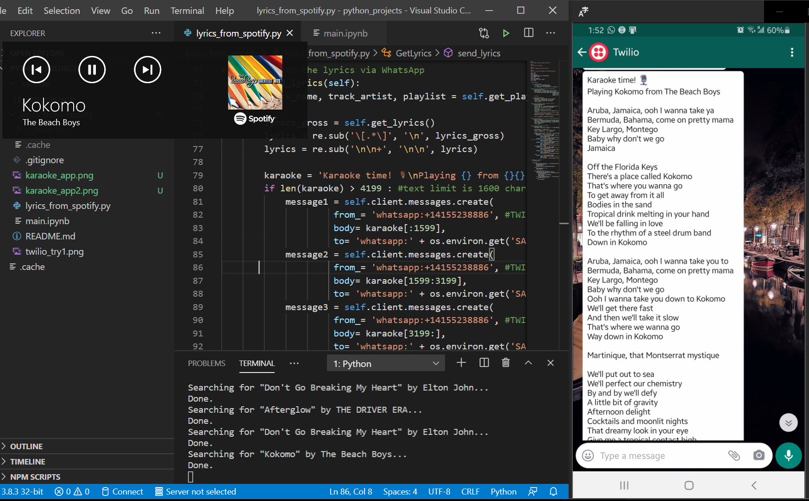

# Karaoke Project

*This is a side project only for personal purpose.*
*My main goal was to reinforce my knowledge and work on topics I used to struggle with such as OOP and APIs.*

## Content
* [Project Description](#project-description)
* [Ressources](#ressources)
* [Notes](#notes)

## Project Description

Well, I love music! I tried to canceled my Spotify Premium account once... I subscribed again after only a week!   
Which is why I wanted to realise a small and fun project related to music. See, now that all bars and clubs are closed I really miss dancing and singing (also because I'm a terrible singer and that way no one can hear me!) but it really annoyed me to pause my playlist, look for the song's lyrics online, skip the ads ...  
It's sounds like a huge waste of time and I wanted to automate those tasks so I can still enjoy singing while doing something else like cooking for example!

##### *So here's the project idea :*
* Connect from my Spotify own account and collect the title, artist and playlist currently playing;
* Perform a search on the Genius website and collect the lyrics of the song playing;
* Using Twilio, send the lyrics via text message on WhatsApp;
* Use a loop so the program detect when a new song is playing and sends the new lyrics.

## Ressources

#### *SPOTIFY WEB API*:
To use the [Spotify API](https://developer.spotify.com/documentation/web-api/), you'll need:
* A Spotify account (free or Premium)
* To register on the developers' platform to get a client ID and a secret key

In my project, I used the Python library [Spotipy](https://spotipy.readthedocs.io/en/2.16.1/).

#### *GENIUS WEB API*:
[Genius](https://genius.com/) is a collaborative website that collects lyrics and provides the story behind the songs. It is one of the biggest platform and as I like listening to emerging bands, I'm pretty sure Genius will have the lyrics of any song I listen to.
To use their API, you'll need to register on their [developers' platform](https://genius.com/developers) to get your personal token.

In my project, I used the Python library [LyricsGenius](https://lyricsgenius.readthedocs.io/en/master/).

#### *TWILIO SANDBOX*:
Twilio is a communication API that I used to send the lyrics on my phone. [Twilio Sandbox](https://www.twilio.com/console/sms/whatsapp/sandbox) is the console used to connect to the WhatsApp platform.   
To set it up:
* Create a free trial account to get your account ID and token
* Connect your number (or someone else's) to the Sanbox by sending 'join eight-shall' to the Twilio phone number
* You can then personnalize your text message before sending it.

## Notes

###### Improvements I'd work on:
* Add a try/except so the program doesn't shut when the lyrics are too long for a text message (or maybe add another options for more messages)
* Find a more elegant way to loop the program
* Use Flask
